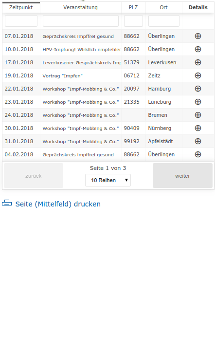

xst_google_events
===

xst_googleCalender fetch Calendar entries from Google Calender and output them to your Webpage.
It's based on react and output an sortable Event-List Table.
No need for PHP or Database-Connection.

You can include it in each Website you need, because it's plain HTML, JS and CSS.

Browser-Support
---
Fully compatiple to following Browsers

  - IE >= 10 1
  - firefox 
  - Chrome
  - Chrome for Android
  - UC Browser for Android
  - Samsung Internet
  - IOS - Safari

1 To support IE lower then IEedege, add https://cdn.polyfill.io/v2/polyfill.min.js into your HTML-Sourcecode.

Requirements
---
  1. CALENDAR_ID - the Calendar-Id of your Google Calendar. You'll find it in your Calendar-Settings: [How to get the Calender-ID](./xst_googleCalendar_getCalendar_id.mp4)
  2. API_KEY - to access your Google-Calendar. Go get it on https://console.developers.google.com: [How to create a Google-Calendar Api-Key](./How to create a Google Api Key.pdf)

Development
---
Required installed Software: 
 - npm
 - webpack
 
After you've download the sources, run npm -i to install needed packages.
If you change something in the JS-Files, run `webpack -p`. Feel Free to adjust your webpack.config.js (e.g for another output-path of bundled js). 

License
---
  - React, React-Dom, React-Table, Superagent  =  [MIT](https://spdx.org/licenses/MIT.html) 

ToDo
---
  - Optimize index.html to show a nicer preview of functionality
  - implement kind of auto- detector/loader to load polyfill.io for IE 10 & 11
  - use Language-Files for Labels (Table, Buttons etc.)  